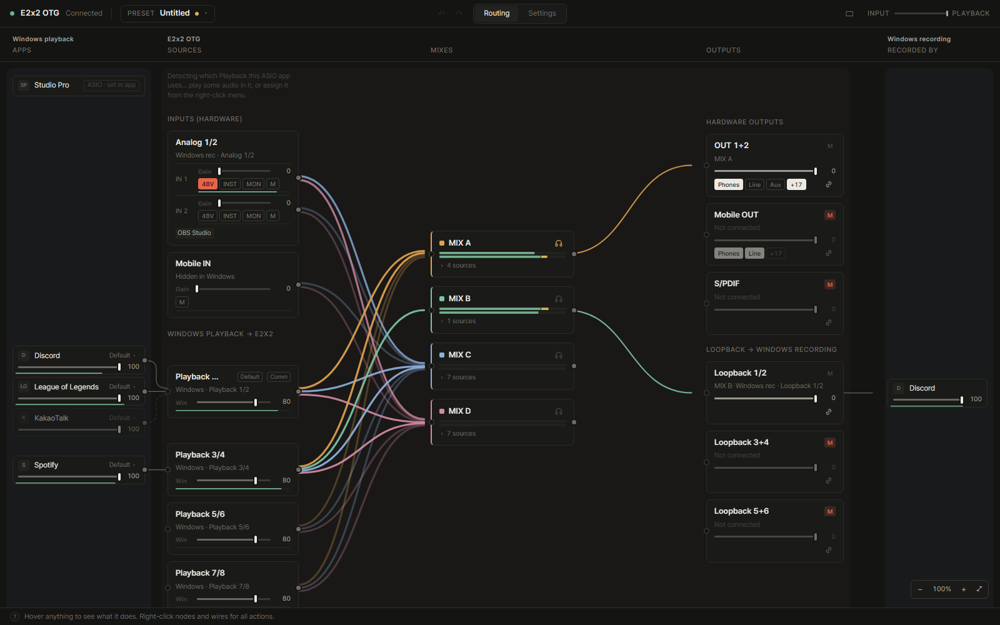

<div align="center">


# TPConsole

**TOPPING E2x2 OTG의 모든 소리 흐름을 한눈에 보고, 바꾸세요.**

입력, 믹스, 출력, 루프백, 그리고 Windows 앱까지 하나의 라우팅 화면에 담은 Windows용 제어 앱입니다.

[](https://github.com/gkfyddl2662/TPConsole/releases/latest)


[English](README.md) · 한국어



</div>

## 왜 TPConsole인가요

E2x2 OTG는 본체에서 보이는 것보다 훨씬 많은 것을 연결할 수 있습니다. 하드웨어 믹스 4개, 루프백 3개,
재생 채널 4쌍. TPConsole은 이 모두를 한 화면에 놓고 Windows에서 일어나는 일과 이어 줍니다.
마이크, 게임, 음악이 어디로 가는지 바로 보이고, 선을 끌어서 바꿀 수 있습니다.

## 기능

**라우팅 화면**
- 입력, Windows 재생 채널, MIX A~D, 출력, 루프백을 노드로, 연결을 선으로 표시
- 믹스마다 보내는 크기와 좌우 위치, 선과 노드에 실시간 레벨 미터
- Windows 앱도 같은 화면에: 앱을 다른 재생 장치로 옮기기, 앱 볼륨, 루프백을 녹음하는 앱 보기

**일상 조작**
- 입력마다 게인, 48V, INST, MON, 음소거 / 출력 볼륨, 단자 선택, +17 dBu
- 프리셋(Windows 라우팅 포함 가능)과 앱을 켜면 자동으로 바뀌는 프리셋
- 게임 중에도 동작하는 전역 단축키, 작은 미니 모드, 트레이 아이콘
- 장치 메모리를 자동으로 맞춰 두어 PC 없이도 같은 설정으로 켜짐

**방해하지 않게**
- Windows 시작 시 트레이에서 실행, 숨어 있을 때는 CPU를 거의 쓰지 않음
- 다크/라이트 테마, 한국어/영어
- GitHub 릴리스로 백그라운드 자동 업데이트
- 문제 보고 한 번에: 기록을 파일 하나로 모아 메신저에 바로 붙여넣기

**선택: Windows 장치 더 만들기**
- 드라이버의 가상 채널로 재생·녹음 장치를 더 만들고 다른 노드처럼 연결
  (직접 준비한 플러그인 파일 필요 — 아래 참고)

## 내려받기

1. [최신 릴리스](https://github.com/gkfyddl2662/TPConsole/releases/latest)에서 **`TPConsole-Setup-x.y.z.exe`**를 받습니다.
2. 실행해서 **설치**를 누릅니다. 새 앱이라 SmartScreen 안내가 뜨면 *추가 정보 → 실행*을 누르세요.
3. 시작 메뉴에서 TPConsole을 엽니다.

**필요한 것:** Windows 10 또는 11(x64) · TOPPING E2x2 OTG · TOPPING USB 오디오 드라이버 5.74
(TOPPING Professional Control Center를 설치하면 함께 설치됨). .NET은 따로 설치하지 않아도 됩니다.

TPConsole은 Windows 오디오 장치를 바꾸기 때문에 관리자 권한으로 실행됩니다. 설치한 앱은 자동으로
업데이트되며, *설정 → 업데이트*에서 끌 수 있습니다.

## 장치 더 만들기 (가상 라우팅)

추가 재생·녹음 장치는 Thesycon의 DSP 믹서 플러그인 `tusbaudiodsp_mixer.sys`를 씁니다. 다른 회사의
파일이라 **포함하지 않습니다**. 드라이버와 같은 버전(5.74)의 파일이 있다면 *설정 → 가상 라우팅 →
파일 선택*에서 한 번 고른 뒤 *설치*를 누르세요.

## 새 소식

[릴리스](https://github.com/gkfyddl2662/TPConsole/releases)마다 바뀐 점이 적혀 있습니다.

## 문제가 생겼다면

*설정 → 고급 → 진단 → 기록 파일 복사*를 누르면 버전과 최근 기록이 파일 하나로 클립보드에 담깁니다.
이슈, 디스코드, 메일에 붙여넣기(Ctrl+V)만 하면 됩니다. Windows 사용자 폴더 경로는 가려집니다.

## 직접 빌드하기

.NET 10 SDK와 Node.js 22가 필요합니다.

```powershell
powershell -ExecutionPolicy Bypass -File tools\package.ps1
```

설치 파일은 `dist\`에 만들어집니다. `main`에 코드가 올라오면 [GitHub Actions](.github/workflows/release.yml)가
빌드해서 릴리스로 배포합니다.

## 안내

TPConsole은 독립 프로젝트이며 TOPPING과 관계가 없고, TOPPING의 지원을 받지 않습니다.
"TOPPING", "E2x2 OTG"는 해당 소유자의 상표입니다. 펌웨어 업데이트도 할 수 있지만 공식 Control Center로
하는 것을 권장합니다. 사용에 따른 책임은 사용자에게 있습니다.
